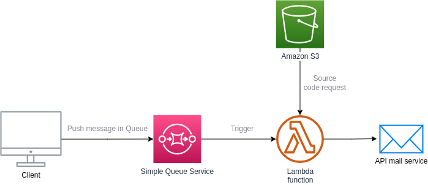

# Serverless AWS lambda example


## DESCRIPTION :

This project shows how to deploy function to AWS lambda from Serverless framework on custom domain

If you don't have any domain name certificate you can 
- Skip steps like inital put-parameter commands
- Skip serverless-domain-manager installation
- Remove it from plugins in serverless.yml
- Remove *customDomain* section under *custom* raw in serverless.yml

## Setup cloud environment
- Create bucket on AWS S3 [doc](https://docs.aws.amazon.com/AmazonS3/latest/userguide/creating-bucket.html)
- Define secret variables
```bash
aws ssm put-parameter --name DOMAIN_NAME_SERVERLESS --value ${DOMAIN_NAME_SERVERLESS} --type SecureString
aws ssm put-parameter --name CERTIFICATE_NAME --value ${CERTIFICATE_NAME} --type SecureString

aws ssm put-parameter --name API_KEY_SERVERLESS --value ${API_KEY_SERVERLESS} --type SecureString
aws ssm put-parameter --name S3_BUCKET --value ${S3_BUCKET} --type SecureString
```
- Deploy your function
```bash
npm install -g serverless
sls plugin install -n serverless-python-requirements
sls plugin install -n serverless-domain-manager
sls create_domain
sls deploy --verbose --conceal
```

### Cloud architecture :




# Files structure

```
Serverless-AWS-transactional-mailer
 │
 ├── src
 │   └── hello
 │        └── hello.py
 │
 ├── test
 │    └── hello.py
 │
 ├── requirements.txt
 │
 ├── serverless.yml
 |
 └── ressources
```